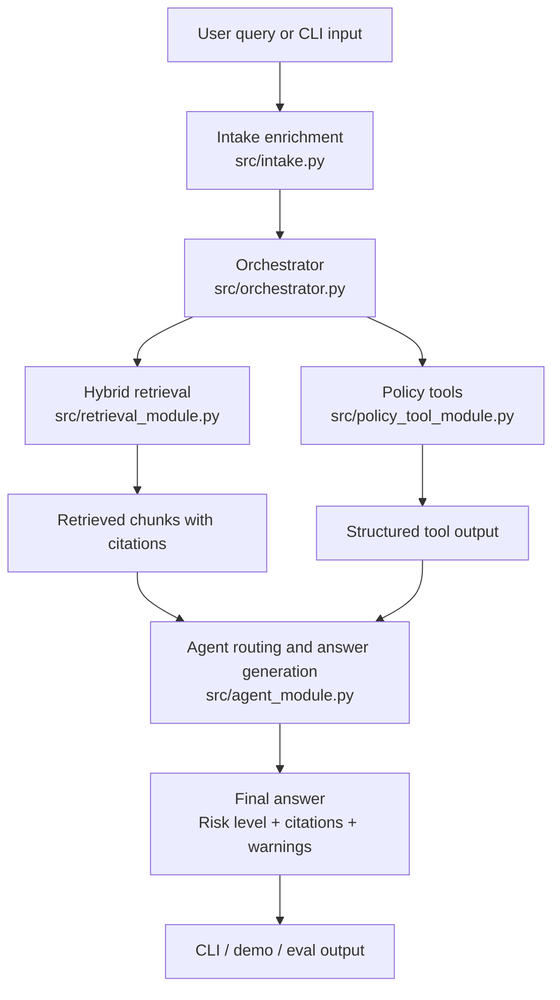

# Canada Immigration & PR Navigator

Team 3 — MVP implementation.

## What this project includes

- Shared schema contracts for all modules (Pydantic)
- Multi-turn intake state machine with profile collection
- End-to-end orchestrator with intent routing, L3 safety gate, and D-003 retry logic
- Scoring-based intent classifier (5 intents, typo-tolerant, personal-context amplifier)
- Risk-level routing with decision trace (`risk_explain` in every response)
- Hybrid BM25 + vector retrieval (ChromaDB, local index)
- CRS calculator policy tool
- Action-specific LLM prompt templates (4 action types, QA sub-type selection)
- Flask web UI served on port 5050
- Express Entry draw data ingestion from IRCC JSON API
- Eval harness with intent accuracy, confusion matrix, and citation checks

This repo is in an interactive MVP phase, not a production-ready release phase. The architecture and contracts are in place, but answer quality still depends on continued retrieval, ingestion, and prompt tuning.

## What is implemented on `main`

- Shared Pydantic contracts in `src/schemas.py`
- LLM client wrapper for the course endpoint in `src/llm_client.py`
- End-to-end pipeline wiring in `src/orchestrator.py`
- Interactive terminal chat loop in `src/chat_cli.py`
- Hybrid retrieval in `src/retrieval_module.py`
  - BM25 weight `0.6`
  - Vector weight `0.4`
  - ChromaDB persistent index in `chroma_db/`
  - Post-hybrid reranking
- Section-based ingestion in `src/ingestion_module.py`
- Agent intent detection, risk routing, and answer generation in `src/agent_module.py`
- Federal Express Entry CRS calculator and Action 1 pathway backbone in `src/policy_tool_module.py`
- Evaluation and hallucination-report scripts in `eval/`

## System flow



## MVP readiness snapshot

| Track | Status | Notes |
|------|--------|-------|
| Shared schemas and integration contracts | Done | Centralized in `src/schemas.py` |
| End-to-end orchestrator | Done | Includes D-003 retry handling |
| Interactive CLI | Done | Terminal QA path is available |
| Hybrid retrieval baseline | Done | BM25 + vector + rerank is wired |
| Section-based ingestion | Done | Writes raw snapshots and chunk JSONL |
| Federal EE CRS tool | Done | MVP scope only |
| Evaluation pipeline | Done | Baseline and hallucination reports exist |
| Broader policy-tool coverage | In progress | Beyond Federal EE is still out of MVP scope |
| Retrieval quality tuning | In progress | Depends on corpus quality and eval feedback |
| Freshness / crawl SLA automation | Not done | Still a post-MVP concern |

## Repository layout

```text
.
├── README.md
├── requirements.txt
├── src/
│   ├── schemas.py              — Pydantic contracts (IntakeProfile, FinalAnswer, …)
│   ├── llm_client.py           — LLM endpoint wrapper
│   ├── orchestrator.py         — Pipeline wiring (intent → retrieval → tools → answer)
│   ├── agent_module.py         — Intent classifier, risk routing, answer builder
│   ├── retrieval_module.py     — Hybrid BM25 + vector retrieval (ChromaDB)
│   ├── ingestion_module.py     — HTML scraping, chunking, indexing
│   ├── fetch_draws_data.py     — Express Entry draw data fetcher (IRCC JSON API)
│   ├── policy_tool_module.py   — CRS calculator, pathway backbone tools
│   ├── intake.py               — Multi-turn intake state machine
│   ├── app.py                  — Flask web server (port 5050)
│   ├── chat_cli.py             — Terminal interactive chat loop
│   ├── main.py                 — Smoke test (connectivity + mock pipeline)
│   └── agent/
│       └── system_prompt.py    — System prompt v1, risk-tier templates
├── data/
│   ├── raw/                    — Scraped HTML + ee-rounds-data.json snapshot
│   └── processed/
│       └── chunks.jsonl        — Chunked policy text (BM25 + embedding input)
├── chroma_db/                  — Persistent ChromaDB vector index
└── eval/
    ├── samples.jsonl           — 15 eval samples (intent labels, risk levels)
    └── run_eval.py             — Eval harness with intent confusion matrix
```

## Prerequisites

- Python 3.11
- pip + venv
- Valid student bearer token for LLM endpoint
- ChromaDB index built (see **Build retrieval index** below)

## Setup

1. Create and activate a virtual environment:

```bash
python3.11 -m venv .venv
source .venv/bin/activate
```

2. Install dependencies:

```bash
pip install -r requirements.txt
```

3. Create a `.env` file in the project root:

```dotenv
LLM_ENDPOINT=https://rsm-8430-finalproject.bjlkeng.io/v1/chat/completions
LLM_API_KEY=<your_student_id_token>
LLM_MODEL=qwen3-30b-a3b-fp8
```

## Build retrieval index

Run once before first use (or after adding new data):

```bash
python -m src.ingestion_module
python -m src.fetch_draws_data --offline   # inject Express Entry draw data
```

`--offline` uses the local snapshot in `data/raw/ee-rounds-data.json`.
Omit `--offline` to fetch the latest draw results live from IRCC.

## Launch web chatbox (recommended)

```bash
python -m src.app
```

Opens at **http://localhost:5050**. Supports free-text queries — no profile
fields required for factual and policy questions.

## Demo guide

Terminal-only, no web UI:

```bash
python -m src.chat_cli
```

Available commands: `/help`, `/show`, `/set province <value>`,
`/set program <value>`, `/set stream <value>`, `/clear`, `/exit`

## Run smoke test

```bash
python -m src.main
```

Tests LLM endpoint connectivity and runs a mock pipeline pass.

## Run eval harness

```bash
python -m src.ingestion_module all
```

Output: `eval/results/latest.json`

Metrics reported:
- `pass_rate` — answer content + citation checks
- `intent_accuracy` — classifier accuracy over labelled samples
- `intent_confusion_matrix` — per-intent breakdown

Intent-only fast check (no LLM call, <5 s):

```bash
python -m eval.run_eval --intent-only
```

## Keep draw data current

IRCC publishes new draw results roughly every two weeks. Refresh:

```bash
python -m src.fetch_draws_data          # live fetch + rebuild index
python -m src.fetch_draws_data --offline # rebuild from local snapshot only
```

## Run Ontario retrieval demo

```bash
python -m src.demo_ontario_flow
```

Demonstrates ingest → retrieve → cite for the OINP Masters Graduate Stream.

```bash
python -m src.ingestion_module P0
```

- Role A (Ella): `src/agent_module.py` — intent classifier, risk routing, answer builder
- Role B (Keqing): `src/retrieval_module.py`, `src/agent/system_prompt.py` — hybrid retrieval, system prompt
- Role C (Yuhan): `src/policy_tool_module.py`, `src/llm_client.py`, `src/schemas.py`, `src/orchestrator.py` — tools, contracts, pipeline
- Role D (Chao): `src/ingestion_module.py`, `src/fetch_draws_data.py` — data ingestion, draw data
- Role E (Ehraaz): `src/app.py`, `src/intake.py` — web server, intake state machine

- raw HTML snapshots in `data/raw/`
- processed chunks in `data/processed/chunks.jsonl`
- persistent vector index in `chroma_db/`

- Do not change function signatures without notifying Role E + Framework Owner.
- Add all cross-module data fields in `src/schemas.py` only.
- Keep citation fields intact in every `FinalAnswer`:
  - `source_url`
  - `section_or_title`
  - `effective_date_or_last_updated_or_unknown`
  - `accessed_at`
- After meaningful changes, run `python -m eval.run_eval`.
- The intake gate in `src/app.py` is bypassed for `qa`, `general`, and `calculate`
  intents — these query types do not require a full user profile.

## Known limitations

- `qwen3-30b-a3b-fp8` in reasoning mode consumes token budget for thinking before
  generating output. Use `max_tokens ≥ 2048` (already set in `_call_llm`).
- IRCC draw cutoff numbers are loaded via JavaScript on the rounds page — static
  HTML scraping captures no actual values. Use `python -m src.fetch_draws_data`
  to fetch the data from the IRCC JSON API instead.
- ChromaDB default collection cap is 2000 documents; the full corpus is 2451 chunks.
  Run `python -m src.ingestion_module` followed by `python -m src.fetch_draws_data`
  to rebuild with the full set.

## Current implementation status

- ✅ Shared contracts (schemas) — `FinalAnswer` includes `risk_explain`, `intent_scores`, `intent_top2`, `intent_ambiguous`
- ✅ Orchestrator pipeline — intent → L3 safety gate → retrieval → tools → risk routing → answer → retry
- ✅ Intent classifier — scoring-based, 5 intents, typo-tolerant, personal-context amplifier
- ✅ Risk routing with explain trace — L1/L2/L3 with decision steps in every response
- ✅ Hybrid retrieval — BM25 (weight 0.6) + ChromaDB vector (weight 0.4), local index
- ✅ CRS calculator policy tool
- ✅ Action-specific prompt templates — 4 action types; QA sub-typed (factual vs document)
- ✅ Web UI — Flask + `python -m src.app` → http://localhost:5050
- ✅ Multi-turn intake — bypassed for factual/policy queries that don't need profile fields
- ✅ Express Entry draw data — `src/fetch_draws_data.py` injects cutoff history into index
- ✅ Eval harness — pass rate, intent accuracy, confusion matrix; 11/11 intent samples pass

```bash
python eval/run_hallucination_report.py
```

Generate the manual-answer-audit hallucination report:

```bash
python eval/run_manual_hallucination_report.py
```

Common evaluation artifacts:

- `eval/baseline_report.json`
- `eval/baseline_report.txt`
- `eval/hallucination_comparison.json`
- `eval/manual_hallucination_report.json`
- `eval/manual_hallucination_report.txt`

## Key product and architecture rules

Frozen MVP decisions live in `docs/Decision-Log.md`. The current implementation follows these constraints:

- D-001: tiered refusal policy
- D-002: minimum intake fields and missing-field rules
- D-003: one-retry no-evidence flow
- D-004: hybrid retrieval + reranking + metadata filtering
- D-005: evals-driven iteration
- D-007: required citation fields must remain intact
- D-008: CRS tool scope is Federal Express Entry only for MVP

Required citation fields:

- `source_url`
- `section_or_title`
- `effective_date_or_last_updated_or_unknown`
- `accessed_at`

## Current capabilities

- Route user questions into the 4 product action types
- Enrich structured intake fields from free-text queries
- Retrieve citation-bearing chunks with metadata-aware filtering
- Retry retrieval once when no evidence is found
- Refuse or degrade answers according to risk level
- Estimate Federal Express Entry CRS for user-specific scoring flows when enough profile context is available
- Produce eval reports that can be tracked across iterations

## Current limitations

- This is still an MVP learning system, not legal or professional immigration advice.
- The hosted model can return thin or empty content under low token budgets in reasoning mode.
- CRS support is limited to Federal Express Entry and is not a full provincial-program calculator.
- Retrieval quality still depends on source coverage, chunk quality, and ranking tuning.
- Ingestion is working, but it is not yet a full audited freshness pipeline with SLA automation.
- Privacy scope remains session-only; persistent user data storage is out of scope for MVP.

## Role ownership

- Role A, Data & Retrieval, Ella Lu:
  - `src/retrieval_module.py`
  - `src/ingestion_module.py`
- Role B, Agent & Prompt, Keqing Wang:
  - `src/agent_module.py`
  - `src/intake.py`
  - `src/agent/`
- Role C, Policy & Tools + Framework Owner, Yuhan Ren:
  - `src/policy_tool_module.py`
  - `src/llm_client.py`
  - `src/schemas.py`
- Role D, Eval & Quality, Chao Tang:
  - `eval/`
- Role E, Integration & UX, Ehraaz Atif:
  - `src/orchestrator.py`
  - integration and demo flows

## Working agreements

- Do not change shared function signatures casually; integration depends on them.
- Add cross-module fields only in `src/schemas.py`.
- Preserve citation fields in all grounded outputs.
- If a code change affects behavior, update `docs/Decision-Log.md`.
- After meaningful implementation changes, rerun the appropriate eval scripts.

## Why this README is organized this way

This version is optimized for fast handoff and presentation. A new reader should be able to answer three questions quickly:

1. What already works on the current main branch?
2. How do I run the important paths without guessing commands?
3. What is still MVP-scoped or incomplete so expectations stay realistic?

## Recommended read order for teammates and AI assistants

1. `docs/README.md`
2. `docs/Decision-Log.md`
3. `docs/Team-Decision-Checklist.md`
4. `docs/Team-Workflow-and-Roles.md`
5. `docs/AI-Assistant-Handoff.md`

## Related files

- `docs/README.md`
- `docs/Decision-Log.md`
- `docs/AI-Assistant-Handoff.md`
- `.github/copilot-instructions.md`
