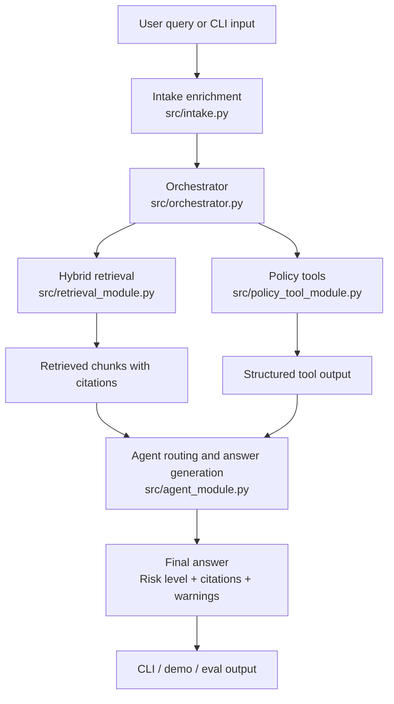

# Canada Immigration & PR Navigator

Current main-branch MVP scaffold for Team 3. This repository is no longer just a bare scaffold: the main branch now includes an interactive CLI, a working orchestrator, hybrid retrieval with ChromaDB, section-based ingestion, a Federal Express Entry CRS tool path, and an evaluation pipeline with report artifacts.

## Current status

| Area | Current state |
|------|---------------|
| Project mode | Framework-first, evals-driven MVP |
| Runtime model path | Hosted course endpoint via `src/llm_client.py` |
| Retrieval baseline | Hybrid BM25 + vector + rerank |
| Tool scope | Federal Express Entry CRS only |
| Citation policy | All grounded answers must preserve required citation fields |
| Integration status | Runnable end-to-end on the current main branch |
| Delivery state | Interactive MVP scaffold, not production-ready |

This repo is in an interactive MVP phase, not a production-ready release phase. The architecture and contracts are in place, but answer quality still depends on continued retrieval, ingestion, and prompt tuning.

## What is implemented on `main`

- Shared Pydantic contracts in `src/schemas.py`
- LLM client wrapper for the course endpoint in `src/llm_client.py`
- End-to-end pipeline wiring in `src/orchestrator.py`
- Interactive terminal chat loop in `src/chat_cli.py`
- Hybrid retrieval in `src/retrieval_module.py`
  - BM25 weight `0.6`
  - Vector weight `0.4`
  - ChromaDB persistent index in `chroma_db/`
  - Post-hybrid reranking
- Section-based ingestion in `src/ingestion_module.py`
- Agent intent detection, risk routing, and answer generation in `src/agent_module.py`
- Federal Express Entry CRS calculator and Action 1 pathway backbone in `src/policy_tool_module.py`
- Evaluation and hallucination-report scripts in `eval/`

## System flow



## MVP readiness snapshot

| Track | Status | Notes |
|------|--------|-------|
| Shared schemas and integration contracts | Done | Centralized in `src/schemas.py` |
| End-to-end orchestrator | Done | Includes D-003 retry handling |
| Interactive CLI | Done | Terminal QA path is available |
| Hybrid retrieval baseline | Done | BM25 + vector + rerank is wired |
| Section-based ingestion | Done | Writes raw snapshots and chunk JSONL |
| Federal EE CRS tool | Done | MVP scope only |
| Evaluation pipeline | Done | Baseline and hallucination reports exist |
| Broader policy-tool coverage | In progress | Beyond Federal EE is still out of MVP scope |
| Retrieval quality tuning | In progress | Depends on corpus quality and eval feedback |
| Freshness / crawl SLA automation | Not done | Still a post-MVP concern |

## Repository layout

```text
.
├── README.md
├── requirements.txt
├── data/
│   ├── raw/
│   ├── processed/
│   └── sources/
├── chroma_db/
├── docs/
├── eval/
│   ├── samples.jsonl
│   ├── run_evaluation.py
│   ├── run_hallucination_report.py
│   ├── run_manual_hallucination_report.py
│   └── scoring.py
└── src/
    ├── agent/
    ├── agent_module.py
    ├── chat_cli.py
    ├── demo_ontario_flow.py
    ├── ingestion_module.py
    ├── intake.py
    ├── llm_client.py
    ├── main.py
    ├── orchestrator.py
    ├── policy_tool_module.py
    ├── retrieval_module.py
    └── schemas.py
```

## Prerequisites

- Python 3.11
- `pip` and `venv`
- A valid student bearer token for the hosted LLM endpoint

## Setup

1. Create and activate a virtual environment:

```bash
python3.11 -m venv .venv
source .venv/bin/activate
```

2. Install dependencies:

```bash
pip install -r requirements.txt
```

3. Create a `.env` file in the project root:

```dotenv
LLM_ENDPOINT=https://rsm-8430-finalproject.bjlkeng.io/v1/chat/completions
LLM_API_KEY=<your_student_id_token>
LLM_MODEL=qwen3-30b-a3b-fp8
```

## Quick start

Run the smoke check:

```bash
python -m src.main
```

This performs:
- a real LLM connectivity check
- a mock end-to-end pipeline run through the orchestrator

## Demo guide

If you need a short presentation flow for a TA, teammate, or demo audience, use this order:

1. Run `python -m src.main` to show the repo is configured and the pipeline boots.
2. Run `python -m src.chat_cli` to show the interactive path and profile-context commands.
3. Ask one CRS-style query to show Action 3 and tool-backed response generation.
4. Run `python -m src.demo_ontario_flow` to show ingestion -> retrieval -> citation-grounded answer.
5. Run `python eval/run_evaluation.py --limit 10` to show the eval-driven workflow.

Good demo question examples:

- `I am 27 years old with a Master's degree in Canada, IELTS 8 7 7 7, and 12 months of Canadian skilled work experience. What is my CRS score?`
- `What is the requirement for Ontario Masters Graduate Stream?`
- `What documents do I need for Express Entry?`

## Run the interactive CLI

```bash
python -m src.chat_cli
```

Available commands inside the CLI:

- `/help`
- `/show`
- `/set province <value>`
- `/set program <value>`
- `/set stream <value>`
- `/clear`
- `/exit`

Notes:
- This is a terminal-based QA path, not a web UI.
- Session profile reuse is supported inside the CLI.
- Persistent user-profile storage is intentionally out of MVP scope.

## Run the Ontario demo flow

```bash
python -m src.demo_ontario_flow
```

This demo shows the intended process shape for teammate alignment:

1. Ingest the Ontario Masters Graduate Stream page
2. Retrieve evidence for the query `what is the requirement for ontario master graduate stream?`
3. Return a citation-grounded answer through the full pipeline

## Run ingestion

Ingest all registry entries:

```bash
python -m src.ingestion_module all
```

Ingest only priority `P0` sources:

```bash
python -m src.ingestion_module P0
```

Artifacts written during ingestion and retrieval:

- raw HTML snapshots in `data/raw/`
- processed chunks in `data/processed/chunks.jsonl`
- persistent vector index in `chroma_db/`

## Run evaluation

Run the baseline evaluation pipeline:

```bash
python eval/run_evaluation.py
```

Run only the first `N` samples:

```bash
python eval/run_evaluation.py --limit 10
```

Generate the lenient hallucination report from existing eval artifacts:

```bash
python eval/run_hallucination_report.py
```

Generate the manual-answer-audit hallucination report:

```bash
python eval/run_manual_hallucination_report.py
```

Common evaluation artifacts:

- `eval/baseline_report.json`
- `eval/baseline_report.txt`
- `eval/hallucination_comparison.json`
- `eval/manual_hallucination_report.json`
- `eval/manual_hallucination_report.txt`

## Key product and architecture rules

Frozen MVP decisions live in `docs/Decision-Log.md`. The current implementation follows these constraints:

- D-001: tiered refusal policy
- D-002: minimum intake fields and missing-field rules
- D-003: one-retry no-evidence flow
- D-004: hybrid retrieval + reranking + metadata filtering
- D-005: evals-driven iteration
- D-007: required citation fields must remain intact
- D-008: CRS tool scope is Federal Express Entry only for MVP

Required citation fields:

- `source_url`
- `section_or_title`
- `effective_date_or_last_updated_or_unknown`
- `accessed_at`

## Current capabilities

- Route user questions into the 4 product action types
- Enrich structured intake fields from free-text queries
- Retrieve citation-bearing chunks with metadata-aware filtering
- Retry retrieval once when no evidence is found
- Refuse or degrade answers according to risk level
- Estimate Federal Express Entry CRS for user-specific scoring flows when enough profile context is available
- Produce eval reports that can be tracked across iterations

## Current limitations

- This is still an MVP learning system, not legal or professional immigration advice.
- The hosted model can return thin or empty content under low token budgets in reasoning mode.
- CRS support is limited to Federal Express Entry and is not a full provincial-program calculator.
- Retrieval quality still depends on source coverage, chunk quality, and ranking tuning.
- Ingestion is working, but it is not yet a full audited freshness pipeline with SLA automation.
- Privacy scope remains session-only; persistent user data storage is out of scope for MVP.

## Role ownership

- Role A, Data & Retrieval, Ella Lu:
  - `src/retrieval_module.py`
  - `src/ingestion_module.py`
- Role B, Agent & Prompt, Keqing Wang:
  - `src/agent_module.py`
  - `src/intake.py`
  - `src/agent/`
- Role C, Policy & Tools + Framework Owner, Yuhan Ren:
  - `src/policy_tool_module.py`
  - `src/llm_client.py`
  - `src/schemas.py`
- Role D, Eval & Quality, Chao Tang:
  - `eval/`
- Role E, Integration & UX, Ehraaz Atif:
  - `src/orchestrator.py`
  - integration and demo flows

## Working agreements

- Do not change shared function signatures casually; integration depends on them.
- Add cross-module fields only in `src/schemas.py`.
- Preserve citation fields in all grounded outputs.
- If a code change affects behavior, update `docs/Decision-Log.md`.
- After meaningful implementation changes, rerun the appropriate eval scripts.

## Why this README is organized this way

This version is optimized for fast handoff and presentation. A new reader should be able to answer three questions quickly:

1. What already works on the current main branch?
2. How do I run the important paths without guessing commands?
3. What is still MVP-scoped or incomplete so expectations stay realistic?

## Recommended read order for teammates and AI assistants

1. `docs/README.md`
2. `docs/Decision-Log.md`
3. `docs/Team-Decision-Checklist.md`
4. `docs/Team-Workflow-and-Roles.md`
5. `docs/AI-Assistant-Handoff.md`

## Related files

- `docs/README.md`
- `docs/Decision-Log.md`
- `docs/AI-Assistant-Handoff.md`
- `.github/copilot-instructions.md`
